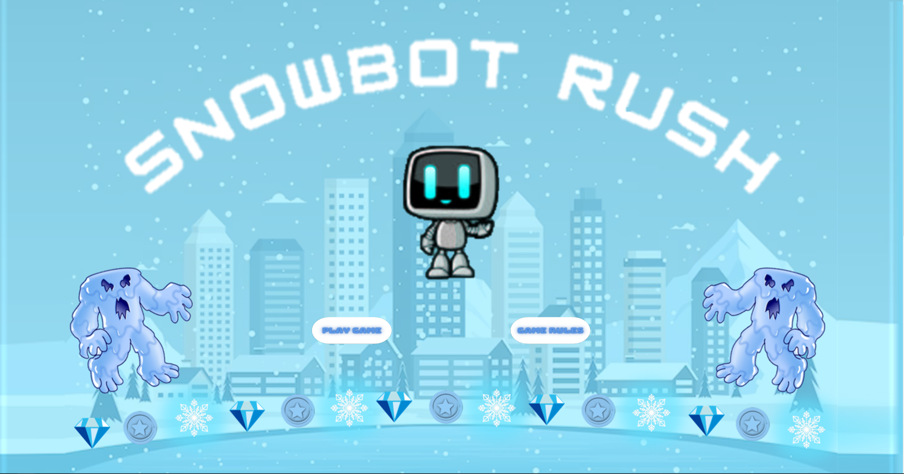
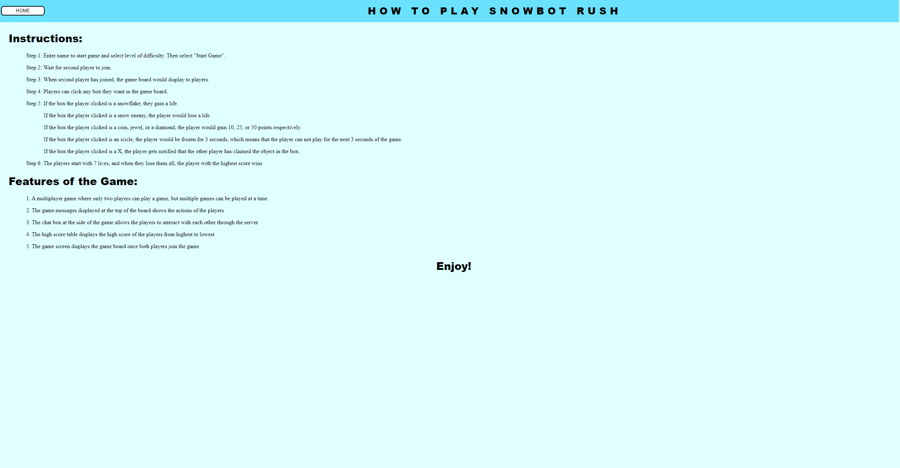
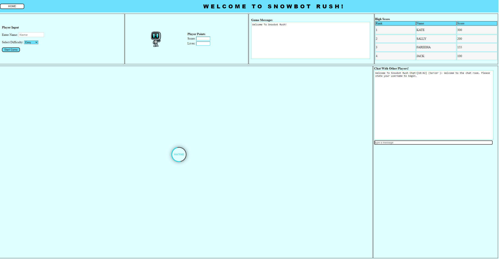
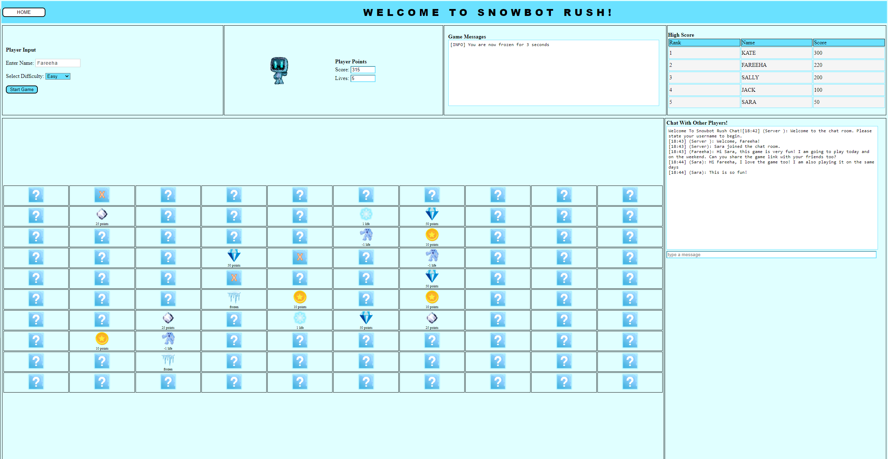
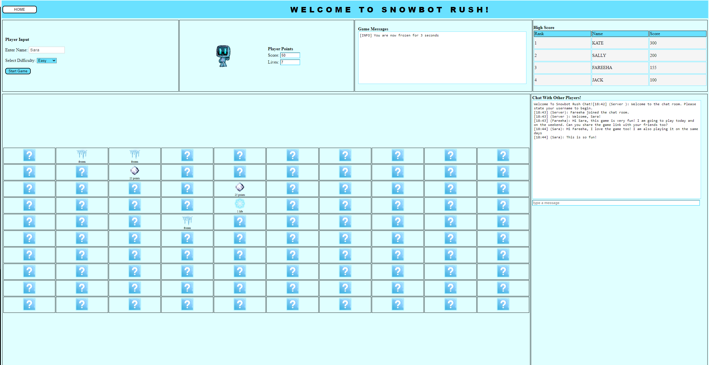

# Final Course Group Project - Team 45
Assignment completed for Software Systems Development and Integration "CSCI - 2020U" for the Winter 2023 semester by:
- Sara Bhoira
- Chantel George
- Fareeha Malik
- Alagu Vallikkannan

## Description
In this final course assignment, our group created a game "SnowbotRush". The objective of the game is for two players 
to compete with each other if they are playing at the same difficulty level. Once the game is started,
a game board appears on both the players screen individually. Both the game boards will have various "good" 
assets such as coins, diamonds, snowflakes or jewels. The game boards will also have various "bad" such as icicles 
or a water monster which causes the game to freeze or lose lives respectively. These assets have to be unveiled by clicking 
the "question marks" The robot character reflects these changes through its appearance. For instance when a player 
unveils the icicle, the robot character will have a frozen appearance. 

Essentially this is a game of chance as you will not know what is behind the qustion mark squares until it is clicked.
You are also competing with another player, who has the same selection of question mark boxes to unveil.

Players may also use with the in-game chat functionality.

## Interface and main functionalities
The screenshots below will help describe the interface and main functionalities of the game.

#### Figure 1
Figure 1 displays the front page of the game, which players will see once successfuly running the index.html file. You can click on the "Play Game" or "Game Rules" button.

#### Figure 2
Figure 2 displays the gameRules.html file which will display if the player clicks on the "Game Rules" button on the index.html page.

#### Figure 3
Figure 3 shows the main game interface. There will be a "waiting" buffer on the page if another player has not joined the same level in a different tab. The game will not start unless there are 2 players playing at the same level.

#### Figure 4
Figure 4 shows the player "Fareeha" who has selected the "Easy" difficulty level. The game board is rendered. In this instance "Fareeha" selected a question mark square which unveiled a "bad" incicle asset. The robot character is now frozen. This is also displayed in the game message text box. There is also a high score display. "Kate", "Sally" and "Jack" are placeholders for reference. Only the top 5 players are showcased on the High Score board. The "Chat With Other Players!" chat box also shows a conversation between players "Fareeha" and "Sara". Also, player "Fareeha" selected on many boxes which display orange "X" symbols. That is because player "Sara" has already selected those on her interface as shown in Figure 5.

#### Figure 5
Figure 5 shows the interface of player "Sara", who is playing against player "Fareeha" in a different tab.

### In-course concept implementation
Below is detailed description of various concepts implemented within this project that include the course concepts
which we were taught throughout the semester:
#### 1. REST API
* In the GameResource class, we implemented the API call to retrieve high scores (path: api/game/highscore).
* JSON format was used to exchange data for the high scores of the top 5 players.
* The first call to the API will result in lazy loading of the high scores from the file saved on the server.
* On client side, the API call to get high scores was set to be invoked every 60 seconds, and this is to refresh the high scores.

#### 2. Files (File, PrintWriter, FileReader, BufferedReader, InputStreamReader)
* The InputStreamReader and BufferedReader classes are used in the GameServer class to read the responses from theh servlet.
* In the GameServlet class, it uses the PrintWriter to send responses in "text/plain" format.
  FileReaderWriter.java
* This class uses FileReader and BufferedReader to read from the file from the server resource folder and PrintWriter to write into the resource file on the server for the player scores.
* This class has functionality to read an existing file, create a new file, or delete a file.

#### 3. Open Data (JSON)
* Used Jackson library to manage the JSON data (classes implemented: ObjectMapper, JsonNode, JsonProcessingException).
* We have a JSON File where high scores are read and written from (file name: highscores.json).
* In the PlayerServerHandler class, it sends information to teh client in a JSON format. For example, sending information on the type of game piece selected by the player on the game board, informing the client if they have won or lost the game, sending the current score and number of lives the player has, etc.

#### 4. URL and URL Connections - Reading Data from our API (HTTP URL Connection)
* We implemented the ClassLoader to get server resource such as the JSON File that holds the high scores.
* The GameServer class makes an HTTP call to a servlet (path: /game-servlet) to retrieve a unique game ID, and the content type is in a "text/plain" format.

#### 5. Socket Programming & Web Sockets in Java
ChatServer.java
* The chat functionality was implemented using web sockets, where all the players can interact with each other.
* The web socket implements the OnOpen, OnClose, and OnMessage connections
* JSON format is used to exchange information between the client and server. For example, the client passing the player name, client sending the chat messages, server broadcasting chat messages to other players, and server informing about the player's entering and exiting the chat.

GameServer.java
* The second web socket class (GameServer.java) was created to manage the game that includes OnOpen, OnClose, and OnMessage methods that were implemented.
* It holds a list of all the game rooms and all the players.
* It implements the functionality for creating a new game room, adding players to a game room, managing user selections, and invoking threads, and overall interactions with the player while the game is running.
* JSON format is used to exchange information between the client and server. For example, server sending error or information messages to client, client sending the selected game piece, server notifying the client about their score and lives, server informing client about the type of game piece selected and the action required, client implementing the responses based on the server responses, etc.
* The GameServer class invokes the servlet to retrieve a unique 5 character game ID.

#### 6. Parallel Programming/Multi-threading (Runnable, Concurrency Model: Reactive & Parallel Worker)
GameServeHandler.java
* This class implements the Runnable interface.
* It is used to manage a game room and is invoked in a parallel worker concurrency model. For example, sending the game board to all the players in the game.

PlayerServerHandler.java
* This class implements the Runnable interface.
* This class is used to take action on user selections on the game board, and direct the client on the responses to those actions.
* Depending on the player selection of the game pieces, this class manages the interactions via the reactive concurrency model.

#### 7. Servlets
GameServlet.java
* This class is used to generate a unique 5 character alphanumeric game code.
* It implements the HTTP doGet() and destroy() method
* The destroy method is invoked when the server is shut down, and used to save the latest game scores of the players in a JSON format to a file on the server.

#### 8. User Interfaces
HTML & CSS Files
* Separate HTML files created for the home page, game page, and game rules page
* CSS was used to set the look and feel of the game

Javascript Files
* Using web sockets it opens connections, closes connections, and sends messages to exchange information with server in JSON format.
* It validates the inputs from the player. For example, has the user entered their username.
* Depending on the server responses, it invokes different types of methods to implement various actions. For example, display information messages, display chat messages, change images on screen, display high scores, display user score and lives, etc.
* It uses functions like setInterval to invoke a function at a regular frequency, such as calling an api to retrieve the top 5 high scores every 60 seconds.
* It uses functions like setTimeout to execute a function after a delay, such as changing the character image back to original after half a second.
* It uses dynamic html functions to create the game board, display images, or change images, etc.

#### 9. Coding Best Practices
* Defensive Programming: checking for null, well-formatted code, commented for easy understanding, followed the maven structure, used constants and enums, lazy loading, etc.
* In the FileReaderWriter class, before performing file operations, the code does various types of checks. For example, if the file exists, the file instance is not null, the file is successfully created, etc.
* Throughout the code, null checks have been implemented before applying any type of operation on the variables or objects. For example, validate if the user has provided their name, check if the game ID is not null before accessing the game room object, in the client side it checks if the web socket connection is not null and active before closing the connection, etc.

Design Patterns - Singleton Class
HighScore.java
* This class was implemented as a singleton to hold the scores of all players.
* A single instance of this class is required to hold the scores of all players and can be accessed throughout the application.
* For example, used by API to retrieve the top 5 player high scores, used by the thread PlayerServerHandler to save player scores.

Constants
* To improve the code maintainability, various constants were created to be used throughout the application.
* For example, type of game pieces, maximum number of players allowed in a game, number of high scores to be displayed, lives a player starts with, etc.

#### 10. Miscellaneous:
* Various types of collections were used - Map: HashMap, Set, List: ArrayList, Iterator, etc.
* In the GameBoard class, we used the Random class to generate numbers to randomly place game pieces on the game board
* In the GamePiece class, it contains data members and respective getter and setter methods for the game pieces.
* In the GameServlet class, we used RandomStringUtils to generate unique alphanumeric code for the game.
* In the Player class, it contains data members and respective getter and setter methods for player information.

## How To Clone and Run Application
1. Clone repository using the GitHub repository link by using the command: git clone.
2. Open the project in IntelliJ
3. Build the project
4. Edit configurations - add GlassFish Local Server, select domain, add artifact war exploded in the deployment, select 
apply and save
5. Run the server
6. Run the index.html file

## Resources
#### Various assets and front page background retrieved from:
1. Front page background retrieved from: https://www.freepik.com/free-photos-vectors/snow-city
2. Robot character retrieved from: https://www.vecteezy.com/vector-art/623956-cute-robot-box-character-designs-with-emotions-poses
3. Water monster character retrieved from: https://publicdomainvectors.org/en/free-clipart/Water-monster/67042.html
4. Coin asset retrieved from: https://pixlok.com/images/game-coin-clipart-png-image-free-download/
5. Diamond asset retrieved from: https://creazilla.com/nodes/35237-diamond-jewelry-clipart
6. Icicle asset retrieved from: https://creazilla.com/nodes/1688816-icicles-clipart
7. Jewel asset retrieved from: https://www.dreamstime.com/illustration/jewels.html

#### Resources used for a deeper understanding of concepts and to implement within our game:
1. https://www.w3schools.com/howto/howto_css_center_button.asp
2. https://www.geeksforgeeks.org/singleton-class-java/
3. https://www.w3schools.com/java/java_enums.asp
4. https://stackoverflow.com/questions/3990319/storing-integer-values-as-constants-in-enum-manner-in-java
5. https://www.java67.com/2014/10/how-to-create-and-initialize-two-dimensional-array-java-example.html
6. https://stackoverflow.com/questions/20389890/generating-a-random-number-between-1-and-10-java
7. https://docs.oracle.com/javase/8/docs/api/java/util/Set.html#method.summary
8. https://mkyong.com/java/java-get-keys-from-value-hashmap/#hashmap-only-has-one-item
9. https://www.w3schools.com/java/java_iterator.asp
10. https://stackoverflow.com/questions/109383/sort-a-mapkey-value-by-values
11. https://stackoverflow.com/questions/13546424/how-to-wait-for-a-websockets-readystate-to-change
12. https://www.w3schools.com/jsref/met_win_setinterval.asp
13. https://www.w3schools.com/jsref/met_element_removeattribute.asp
14. https://www.w3schools.com/jsref/met_document_createelement.asp
15. https://www.encodedna.com/javascript/populate-json-data-to-html-table-using-javascript.htm
16. https://fasterxml.github.io/jackson-databind/javadoc/2.7/index.html?com/fasterxml/jackson/databind/JsonNode.html
17. https://docs.oracle.com/javaee/6/tutorial/doc/bnags.html
18. https://www.w3schools.com/jsref/prop_style_cursor.asp
19. https://www.html-code-generator.com/css/textbox-style

### Libraries 
- jakarta
- jackson 

### Packages
- java.util
- java.io
- org.apache
- java.net

